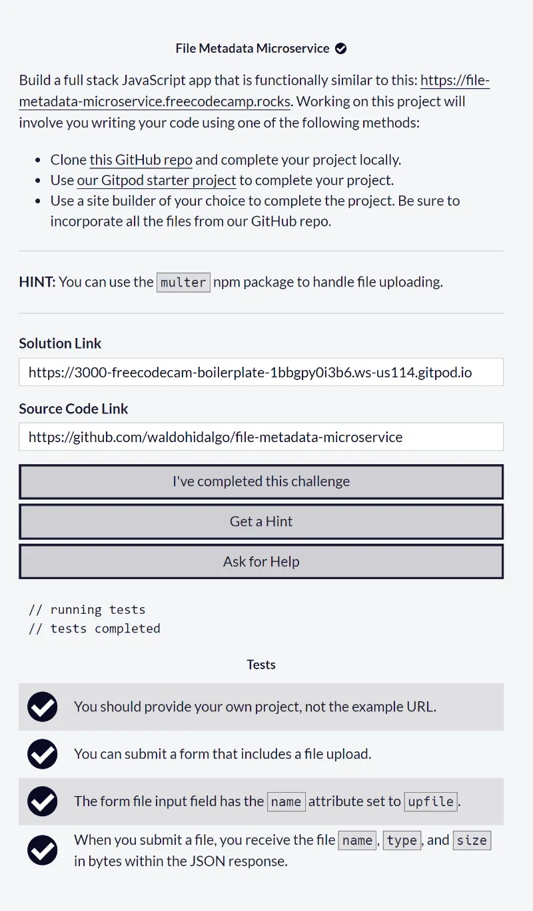
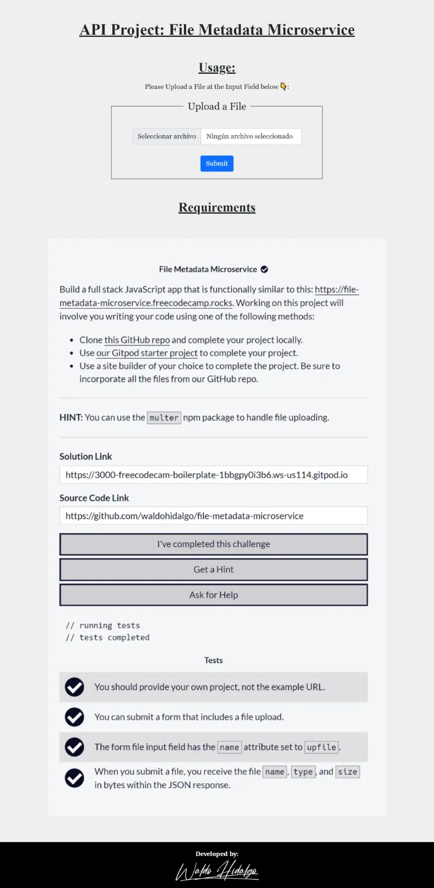
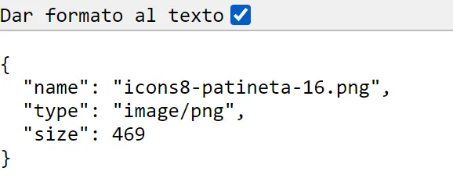

# File Metadata Microservice

Repositorio con el código solución al último proyecto [**File Metadata Microservice**](https://www.freecodecamp.org/learn/apis-and-microservices/apis-and-microservices-projects/file-metadata-microservice) para obtener la **Back End Development and APIs Certification** de freecodecamp.

## Tabla de Contenidos

- [File Metadata Microservice](#file-metadata-microservice)
  - [Tabla de Contenidos](#tabla-de-contenidos)
  - [Requisitos](#requisitos)
  - [Screenshots](#screenshots)
    - [1. Home Page](#1-home-page)
    - [2. JSON Response](#2-json-response)

## Requisitos

## Screenshots

### 1. Home Page

### 2. JSON Response

